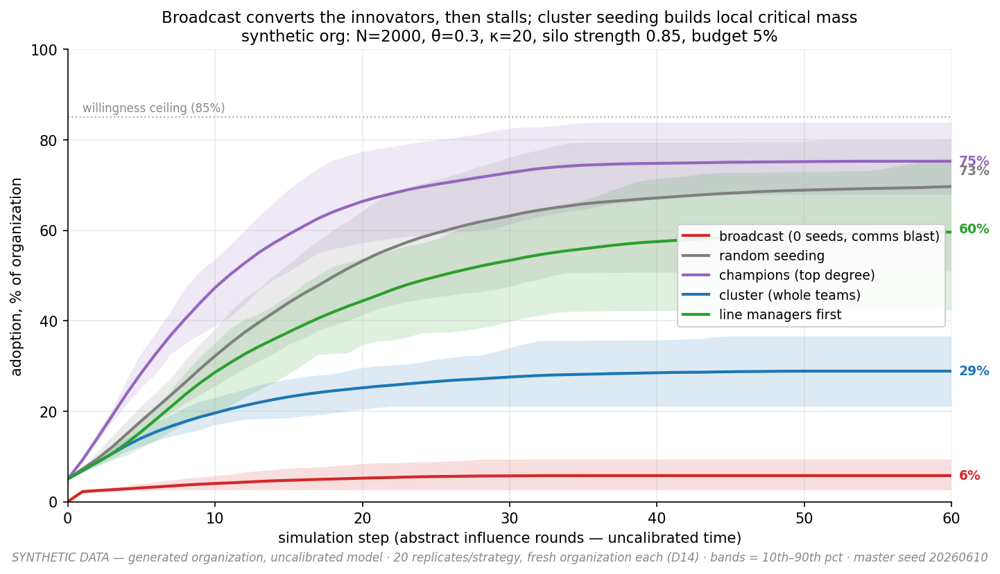

# adoption-sim

**A research simulator of complex contagion on synthetic organizational networks.**
When does a broadcast-style rollout fail where cluster-based seeding succeeds — and
which structures (silos, thresholds, relays) decide the outcome?

> **⚠ Everything this tool produces is synthetic.** Generated organizations,
> stipulated thresholds, uncalibrated dynamics. It is an instrument for reasoning
> about *mechanisms* — never a forecast of any real rollout. The full list of things
> you cannot conclude is in [docs/limitations.md](docs/limitations.md), and it is
> long on purpose.



*Synthetic data: N=2000, θ̄=0.30, silo strength 0.85, seed budget 5%, 20 replicates
per strategy per panel, bands = 10th–90th percentile. Broadcast (red — **0 seeds:
it buys awareness, not adopters**) converts only the zero-threshold innovators in
the κ=20 regime (~6%, left) and becomes a high-variance lottery in the κ=12 regime
(5–48%, right); real-world threshold heterogeneity is unmeasured, so the regime is
an open empirical question (D1). Cluster seeding (blue) builds local critical mass;
and — the negative result we report rather than hide — scattered strategies win on
raw reach in both regimes, even with the innovator atom removed entirely.
Experiment 1 explains all of it; experiment 3 shows why invisibility of usage
rescues nothing (it's provably just threshold inflation) and what observable-pilot
rituals actually buy.*

## Reproduce the headline figure (target: under 15 minutes)

```bash
git clone <REPO_URL>           # TODO: URL lands here at public release
cd <the cloned directory>
python3 -m venv .venv && source .venv/bin/activate        # Python ≥ 3.11
pip install -r requirements-dev.txt -c constraints.txt    # ~1-4 min
jupyter lab experiments/01_broadcast_vs_cluster.ipynb     # Run → Run All Cells
```

Headless equivalent of "Run All":
`python -m jupyter nbconvert --to notebook --execute --inplace experiments/01_broadcast_vs_cluster.ipynb`

The notebook executes in **well under a minute** on a recent laptop (an independent
fresh-clone test measured 113 s from clone to figure, ~25 s of it the notebook; the
budget is dominated by `pip install`). It regenerates `docs/figures/headline.png` and
all CSVs in `experiments/results/` — **bit-for-bit under `constraints.txt`** (one
master seed drives everything; newer numpy releases may change random streams, which
is why the constraints file exists). After a successful run, `git status` will show
only the executed notebook and the `.meta.json` provenance sidecars (timestamps) as
modified — the result CSVs and the PNG should be unchanged. No notebook?
`python experiments/run_experiment1.py` produces the same numbers in the terminal.

Run the test suite with plain `pytest` from the repo root (67 tests, ~15 s).

## The web demo

**One click (macOS/Linux):** double-click **`Launch Demo.command`** at the repo
root — it creates the environment on first run, starts the server, and opens your
browser. Close the Terminal window to stop it.

Or from a shell:

```bash
streamlit run demo/app.py
```

Five controls (size, silo strength, mean threshold, strategy, seed budget) →
adoption curves vs the broadcast reference, a dead-pocket department map, and a
ready/willing/able attribution chart. Deployment to Streamlit Community Cloud:
[demo/README.md](demo/README.md).

## What's in the box

| path | contents |
|---|---|
| `core/` | engine — org generator, threshold dynamics, seeding, metrics, sweeps, ingest. **Imports NetworkX + NumPy + stdlib only** (enforced by a test) |
| `experiments/` | three executed notebooks (headline · sanity checks · observability) + scenario TOMLs + versioned results (CSV + provenance JSON) |
| `demo/` | Streamlit app (synthetic-data banner included) |
| `docs/` | [spec](docs/spec.md) · [model math](docs/model.md) · [assumptions](docs/assumptions.md) · [limitations](docs/limitations.md) · [decision log](docs/decisions.md) · [sanity checks](docs/sanity-checks.md) · [build journal](docs/journal.md) |
| `tests/` | 67 tests: threshold rule on hand-computed graphs, state conservation, determinism (parallel ≡ serial), seeding budgets, stack policy, demo smoke |

## The science, honestly

- **Every modeling choice that affects claims is logged** in
  [docs/decisions.md](docs/decisions.md) with 2–3 alternatives and trade-offs —
  D1–D17 **RATIFIED** at the 2026-06-10 arbitration, several with conditions
  (dual-regime presentation, sensitivity sweeps) that the experiments implement.
  The figure-level claims hang mostly on the threshold distribution (D1/D2) and
  seed budget — measured, not asserted (tornado in
  [docs/sanity-checks.md](docs/sanity-checks.md)).
- **Negative results are reported**: scattered seeding beats cluster seeding on reach
  in this model family — robust to removing innovators entirely (D16); socially-
  reinforced decay produces no spike-then-relapse (D7); no individual pivot relays
  exist in generated orgs (D12); and neither global invisibility nor observable-pilot
  rituals rescue cluster seeding (D17, experiment 3). Each comes with the mechanism
  analysis.
- **Sanity checks**: Granovetter's knife-edge, Centola & Macy's weak-long-ties
  result, and Watts' cascade boundary replicate qualitatively; the D3-null and the
  exact θ/v equivalence pass too (5/5); a real topology (SNAP email-Enron, fetched
  separately) reproduces the qualitative ordering.
- **Every figure states its data is synthetic** — the stamp is baked into the
  plotting helper.

## Requirements & license

Python ≥ 3.11. Runtime: NetworkX, NumPy, Streamlit (dependency policy: nothing else;
additions must be justified). Dev: + matplotlib, jupyterlab, pytest.

**AGPL-3.0** — see [LICENSE](LICENSE). Cite via [CITATION.cff](CITATION.cff).

*Status: v0.1. Calibration on real organizational data is explicitly out of scope
at this stage (spec §1). Time steps are abstract influence rounds.*
